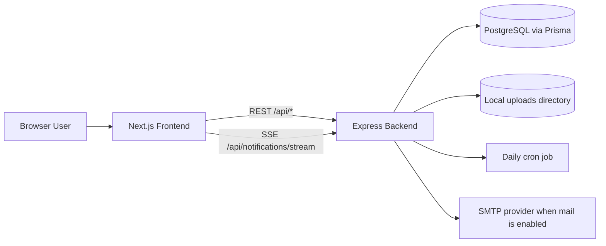
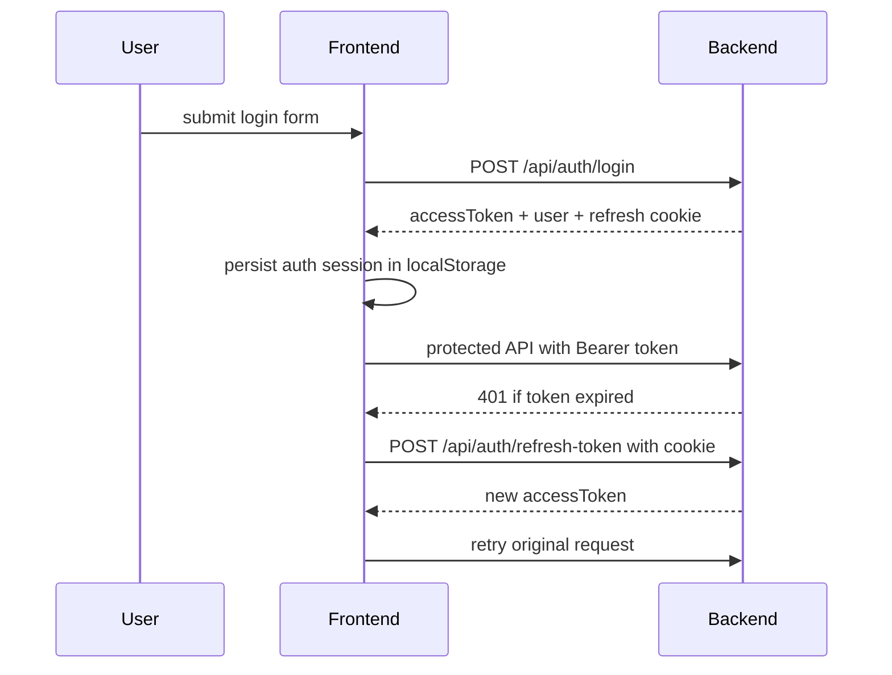

# System Architecture

## 1. High-level topology

## 2. Frontend architecture

### Composition

- `app/layout.tsx` defines the root HTML shell, global font, toaster, and analytics
- `app/dashboard/layout.tsx` wraps dashboard routes with `components/app-layout.tsx`
- pages are mostly client-rendered and perform browser-side data fetching

### State model

- there is no centralized application store
- auth state is reconstructed from `localStorage` and `/api/auth/me`
- page state is mostly local to each route
- notifications are isolated in `hooks/use-notifications.ts`

### API boundary

- all normal HTTP access should go through `lib/api-client.ts`
- `ApiError` preserves `status`, `code`, and `details`
- refresh flow is automatic for protected API calls that return `401`

### UI boundary

- shared primitives live in `components/ui/*`
- domain flows are implemented in reusable feature components under `components/`
- design tokens and motion utilities live in `app/globals.css`

## 3. Backend architecture

### Request pipeline

1. Express global middleware
2. auth middleware if route is protected
3. role middleware if route is role-restricted
4. controller parses request and delegates
5. validation schemas check params/query/body where applicable
6. service executes business rules
7. Prisma reads/writes PostgreSQL
8. response is serialized with `BigInt` converted to strings

### Cross-cutting concerns

- `helmet` security headers
- CORS with credentials support
- global rate limit set to `1000 req/min/IP`
- `pino-http` request logging
- `cookie-parser` for refresh token cookie access
- static file serving at `/uploads`
- centralized error middleware

## 4. Auth and session architecture

### Token model

- access token: JWT returned in response body
- refresh token: JWT stored in `httpOnly` cookie
- frontend persists access token and user info in `localStorage`
- backend does not currently persist refresh tokens in DB

### Flow

### Trade-offs

- simple SPA-friendly implementation
- weak refresh-token revocation story
- browser-stored access token increases XSS sensitivity

## 5. Main business sub-systems

### Leave requests

- frontend reusable flow centers around `components/leave-request-modal.tsx`
- backend source of truth is `backend/src/modules/leave-requests/leave-requests.service.ts`
- balance updates rely on `leave-balances` service helpers
- settings are read from `Setting.value` JSON for policy-related logic

### Leave balances

- annual leave, carry-over, seniority, comp-off, WFH, and used metrics are stored per user / leave type / year
- recalculation and adjustment logic lives in `backend/src/modules/leave-balances/leave-balances.service.ts`
- frontend has a dedicated page at `/dashboard/leave-balances`

### Attendance

- one attendance record per user per date
- check-in/check-out and work-hour logic live in `attendances` module
- attendance screens also mix in leave and holiday context

### Overtime and comp-off

- overtime is a separate approval flow
- approved overtime can generate comp-off records
- expiration is handled by `backend/src/jobs/expire-compoff.job.ts`

### Notifications

- notification records are stored in DB
- REST supports listing and read state updates
- realtime delivery uses in-memory SSE connection tracking keyed by user ID

### Devices

- device inventory is modeled separately from user records
- assignment, return, maintenance, and audit trails are first-class backend modules/entities

### Skills

- skill categories, skills, and user skill mappings are persisted in schema and exposed through dedicated modules

### Audit logs

- operational actions are recorded in `AuditLog`
- frontend exposes a dedicated activity log page

### Mail

- backend can send mail when SMTP env settings are enabled
- mail behavior is controlled by environment configuration plus settings/UI flows

## 6. Data and storage architecture

### Database

- PostgreSQL via Prisma
- most IDs are `BigInt`
- `Setting.value` is JSON and stores flexible configuration

### File storage

- local disk only
- backend exposes the directory via `/uploads`
- frontend proxies upload URLs through Next rewrites

## 7. Environment model

### Frontend env

- `NEXT_PUBLIC_API_URL`
- `BACKEND_URL`
- optional `NEXT_PUBLIC_VERSION`

### Backend env

- `DATABASE_URL`
- `JWT_ACCESS_SECRET`
- `JWT_REFRESH_SECRET`
- `JWT_ACCESS_EXPIRES_IN`
- `JWT_REFRESH_EXPIRES_IN`
- `PORT`
- `NODE_ENV`
- `FRONTEND_URL`
- `UPLOAD_DIR`
- `MAIL_ENABLED`
- `MAIL_HOST`
- `MAIL_PORT`
- `MAIL_SECURE`
- `MAIL_USER`
- `MAIL_PASSWORD`
- `MAIL_FROM_EMAIL`
- `MAIL_FROM_NAME`
- `MAIL_REPLY_TO`

## 8. Architectural risks and debt

- client-oriented route guarding on the frontend
- `ignoreBuildErrors` enabled in Next config
- sparse automated test coverage
- loose JSON contract for settings
- in-memory SSE registry is single-instance oriented
- local-disk uploads are not cloud-native
- duplicated leave-request UI still exists
