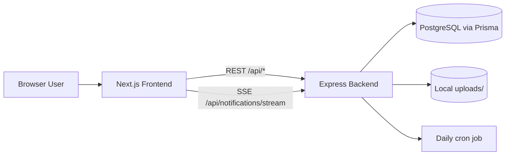
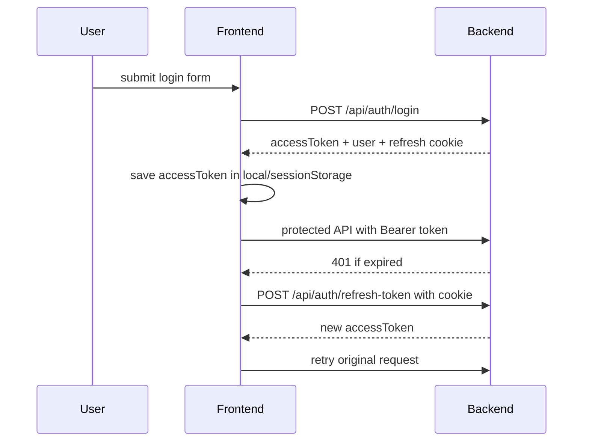
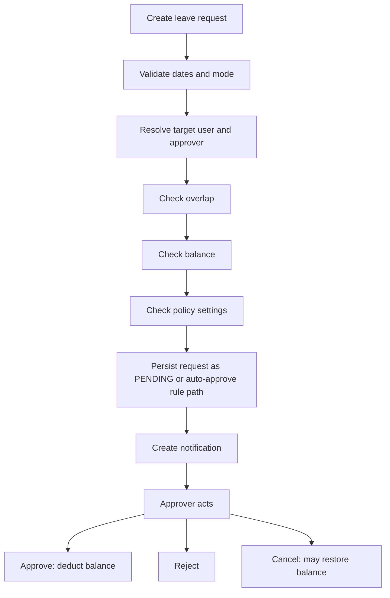

# System Architecture

## 1. High-level view

## 2. Frontend architecture

### Composition

- `app/layout.tsx` sets global HTML shell, font, toaster, analytics.
- `app/dashboard/layout.tsx` wraps all dashboard pages with `components/app-layout.tsx`.
- Page components are mostly client components and fetch data on mount.

### State model

- No centralized store.
- Session state is inferred from browser storage + `/api/auth/me`.
- Page data is local and page-specific.
- Notification state is isolated in `hooks/use-notifications.ts`.

### API boundary

- All network access should go through `lib/api-client.ts`.
- `ApiError` preserves `status`, `code`, and `details` from backend.
- Refresh flow is automatic for most protected API calls.

## 3. Backend architecture

### Request pipeline

1. Express global middleware
2. auth middleware if route is protected
3. role middleware if route is restricted by role
4. controller parses request and validation
5. service executes business rules
6. Prisma reads/writes database
7. response serialized with BigInt -> string conversion

### Cross-cutting concerns

- Security headers via `helmet`
- CORS with credentials support
- global rate limit `200 req/min/IP`
- request logging via `pino-http`
- cookie parsing for refresh token
- static file serving at `/uploads`
- centralized error middleware

## 4. Auth/session architecture

### Current model

- Access token: JWT returned in response body.
- Refresh token: JWT set in httpOnly cookie.
- Backend does not persist refresh tokens in DB.
- Logout clears cookie on response path; there is no token blacklist.

### Flow

### Main trade-offs

- Simple to implement.
- Works well for SPA-style frontend.
- Weak revocation story because refresh tokens are stateless.
- Browser storage for access token increases XSS sensitivity.

## 5. Leave request architecture

### Main flow

### Sources of truth

- Frontend input shaping: `lib/hr-utils.ts`
- Main reusable UI flow: `components/leave-request-modal.tsx`
- Backend validation/business rules: `backend/src/modules/leave-requests/leave-requests.service.ts`
- Leave settings lookup: `backend/src/modules/settings/settings.service.ts`
- Balance change helpers: `backend/src/modules/leave-balances/leave-balances.service.ts`

## 6. Overtime/comp-off architecture

- Overtime and comp-off are separate modules.
- Approved overtime creates an approved comp-off record automatically.
- Comp-off expiration is enforced by daily cron.
- Expiration currently rewrites status from `APPROVED` to `REJECTED`, which is semantically weak.

## 7. Notification architecture

### Current design

- Notification records are stored in database.
- REST endpoints handle list, unread count, mark read, mark all read.
- Realtime uses in-memory SSE connection registry keyed by user ID.

### SSE event types

- `connected`
- `notification.created`
- `notification.read`
- `notification.read-all`

### Limitation

- Current SSE implementation is single-instance friendly only.
- If backend scales horizontally, notifications will need shared pub/sub or websocket infrastructure.

## 8. Data/storage architecture

### Database

- PostgreSQL via Prisma.
- IDs are `BigInt` for most domain tables.
- `Setting.value` is JSON and is used for leave policy / approval flow.

### File storage

- Local disk only.
- Static path exposed at `/uploads`.
- Avatar upload path and leave attachment path share local filesystem strategy.

## 9. Environment model

### Frontend

- `NEXT_PUBLIC_API_URL`
- `BACKEND_URL` for server-side upload rewrites inside Docker

### Backend

- `DATABASE_URL`
- `JWT_ACCESS_SECRET`
- `JWT_REFRESH_SECRET`
- `JWT_ACCESS_EXPIRES_IN`
- `JWT_REFRESH_EXPIRES_IN`
- `PORT`
- `NODE_ENV`
- `FRONTEND_URL`
- `UPLOAD_DIR`

## 10. Main architectural risks

- Client-only route guarding on frontend.
- Ignored TypeScript build errors in Next config.
- Weakly typed JSON settings contract.
- In-memory SSE fanout.
- Duplicated leave request UI flow.
- No strong automated test coverage.
